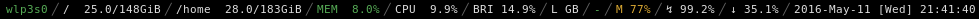

`bar.sh`
========

> i3 status_command script

This script provides a (theoratically shell agnostic) way
to retrieve system information and provide them for i3wm's
status bar.

This script is by no means correct nor the most efficient
one. It also is kinda hacked for my device(s) to work and
thus you might have to change a lot to get it to work for
you.

Just put `status_command sh path/to/bar.sh` into your i3
`bar` configuration block.

## Features

- easily extensible
    - change existing functions or
    - just write your own
- uses `.Xresources`-colors (if you actually remove the
overrides)
- updates on each second (theoratically)
- should be POSIX shell compatible (I'm to lazy to actually
  test this)
- handcrafted for my system
  (Arch Linux, minimalistic, Lenovo T450s)
- does not seem to need to much resources

## Modules

The bar allows to view different "modules" (if you can
really call them that). Currently there are implementations
for the following:

| Module          | Benefit                            |
| --------------- | ---------------------------------- |
| `wlan <iface>`  | Is your WLAN interface up?         |
| `vpn`           | Is the VPN up?                     |
| `disk <dir>`    | Don't download that much...        |
| `memory`        | Browsers and their RAM.            |
| `cpu`           | The heat isn't indicator enough?   |
| `brightness`    | What does `xbacklight` know?       |
| `layout`        | [`xkblayout-state`](https://github.com/nonpop/xkblayout-state) ftw |
| `leds`          | EVERYTHING IS WRONG11!             |
| `volume`        | Sound? What's that?                |
| `battery <num>` | Need to recharge again?            |
| `clock`         | On time.                           |

Each module produces its own text, while the colour depends
on the functions return-value. The colours can be changed as
documented in `jsonfy`.

----------

Do whatever you want, but please remember to mention me as
the original author.

> Dave J (https://github.com/chronus7)

